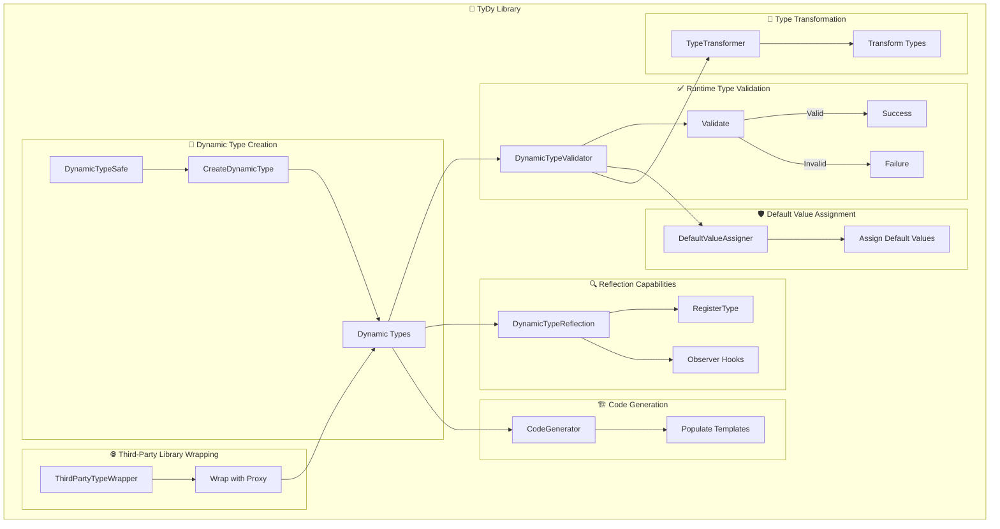

# 🌌 TyDy


[](https://github.com/Mervsy/TyDy/actions/workflows/github-code-scanning/codeql)
🛠 Dynamic, type-safe utilities for TypeScript, focusing on runtime type safety.

## 🎉 Introduction

TyDy, pronounced /ˈtaɪ daɪ/, is a blend of "Ty" for "type" and "Dy" for "dynamic." The library aims to provide dynamic and type-safe utilities at runtime. It is designed for developers who need to handle and ensure type safety during runtime, especially when working with dynamic data structures in TypeScript.

## 🌈 Features

- 💼 **Dynamic Type Creation at Runtime**: Create and work with types dynamically during runtime.
- ✅ **Runtime Type Validation**: Validate the types of your dynamic structures at runtime.
- 🔍 **Reflection Capabilities**: Manage your dynamic types at runtime with observer hooks.
- 🏗️ **Code Generation**: Generate code snippets based on templates with type constraints.
- 🌐 **Third-party Library Wrapping**: Wrap third-party libraries in a type-safe manner.
- 🛡️ **Default Value Assignment**: Assign default values to object properties based on a schema.
- 🔄 **Type Transformation**: Transform object properties to different types based on a schema.

## 🌟 Visualizing TyDy



## 📦 Installation

To install TyDy, run the following command:

```bash
npm install tydy --save
```

## 🚀 Usage

### 🔍 Type Registration with Observer Hooks

TyDy provides a utility called `DynamicTypeReflection` to register types and set up observers for type changes.

```typescript
import { DynamicTypeReflection } from "tydy";
const myDynamicType = { name: "string", age: "number" };
const typeObserver = {
  onTypeAdded: (type) => {
    console.log("Added type:", type);
  },
  onTypeRemoved: (type) => {
    console.log("Removed type:", type);
  },
};
DynamicTypeReflection.addObserver(typeObserver);
DynamicTypeReflection.registerType(myDynamicType);
```

### 💼 Dynamic Type Creation

```typescript
import { DynamicTypeSafe } from "tydy";
const dynamicType = DynamicTypeSafe.createDynamicType({
  name: "string",
  age: "number",
});
const instance = new dynamicType();
```

### ✅ Type Validation

```typescript
import { DynamicTypeValidator } from "tydy";
const type = { name: "string", age: "number" };
const instance = { name: "Alice", age: 30 };
console.log(DynamicTypeValidator.validateType(instance, type)); // true
```

### 🏗️ Code Generation

```typescript
import { CodeGenerator } from "tydy";
const template = "function {{name}}() { return {{value}}; }";
const constraints = { name: "getName", value: '"Alice"' };
const generatedCode = CodeGenerator.generateCode(template, constraints);
```

### 🌐 Third-Party Library Wrapping

```typescript
import { ThirdPartyTypeWrapper } from "tydy";
const someLibrary = {
  getValue: () => "Hello from the third-party library",
};
const wrappedLibrary = ThirdPartyTypeWrapper.wrapWithProxy(someLibrary);
const result = wrappedLibrary.getValue();
```

## Contribution

Interested in contributing to TyDy? See our [contribution guidelines](./CONTRIBUTING.md).

## License

MIT License. See [LICENSE](./LICENSE) for more details.
