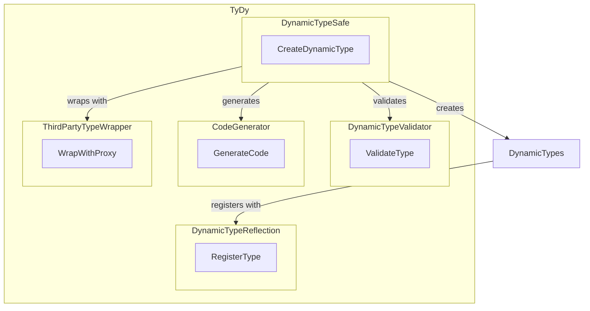

# 🌌 TyDy

🛠 Dynamic, type-safe utilities for TypeScript, in under 150 Lines of Code.

## 🎉 Introduction

The name "TyDy" is a blend of "Ty" and "Dy," where "Ty" represents TypeScript, and "Dy" suggests "dynamic." It reflects the core focus of the library, which is to provide dynamic and type-safe utilities for TypeScript.

TyDy provides a cohesive set of utilities designed for developers working with dynamic data structures in TypeScript. It ensures runtime type safety, offers reflection capabilities, provides validation tools, and more.


## Features

- 💼 Dynamic Type Creation: Generate and work with types on-the-fly.
- ✅ Type Validation: Ensure runtime type safety for your dynamic structures.
- 🔍 Reflection Capabilities: Inspect and manage your dynamic types.
- 🏗️ Code Generation: Generate code based on templates with type constraints.
- 🌐 Third-party Library Wrapping: Interact with third-party libraries in a type-safe manner.

## 📦 Installation

To install TyDy, use the following command:

```bash
npm install tydy --save
```

## 🚀 Usage

## 📚 Type Registration

In your TypeScript projects, you may come across scenarios where type registration becomes essential for maintaining code quality and ensuring type safety. TyDy provides a utility called `DynamicTypeReflection` for this purpose.

### What is Type Registration?

Type registration involves informing the TypeScript runtime system about the existence and structure of dynamic types. It serves as a way to validate, inspect, and work with these types during runtime. While TypeScript performs static type checking at compile-time, type registration can help with runtime type operations.

### When is Type Registration Needed?

Type registration can be beneficial in various scenarios, including:

1. **Dynamic Data Structures:** When you work with dynamic data structures where the shape of an object can change based on user input or external data sources. Registering these dynamic types allows you to validate and manipulate them at runtime.

2. **Third-Party Libraries:** When you interact with third-party JavaScript libraries that may not have TypeScript type definitions. Registering the types used with these libraries helps ensure type safety when using their APIs.

3. **Runtime Configurations:** In cases where your application's configuration is dynamic and can change without a fixed schema, type registration can help validate and reflect on configuration objects.

### How to Register Types

To register a type, you can use TyDy's `DynamicTypeReflection` utility by calling `DynamicTypeReflection.registerType(type)`.

```typescript
import { DynamicTypeReflection } from 'tydy';

const myDynamicType = { name: 'string', age: 'number' };

// Register the dynamic type with the runtime system
DynamicTypeReflection.registerType(myDynamicType);
```

## 💼 Dynamic Type Creation

Import the necessary utilities:

```typescript
import { DynamicTypeSafe } from 'tydy';
```

Now, create a dynamic type:

```typescript
const dynamicType = DynamicTypeSafe.createDynamicType({ name: 'string', age: 'number' });
const instance = new dynamicType();
```

## ✅ Type Validation

Import the type validator:

```typescript
import { DynamicTypeValidator } from 'tydy';
```

Use it to validate types:

```typescript
const type = { name: 'string', age: 'number' };
const instance = { name: 'Alice', age: 30 };
console.log(DynamicTypeValidator.validateType(instance, type)); // true
```

## 🏗️ Code Generation

Import the code generator:

```typescript
import { CodeGenerator } from 'tydy';
```

Use it to create code based on a template with type constraints. 

```typescript
const template = 'function {{name}}() { return {{value}}; }';
const constraints = { name: 'getName', value: '"Alice"' };
const generatedCode = CodeGenerator.generateCode(template, constraints);
```

## 🌐 Third-Party Library Wrapping

Import the third-party type wrapper:

```typescript
import { ThirdPartyTypeWrapper  } from 'tydy';
```

Use it to wrap and interact with a third-party library in a type-safe manner. 

```typescript
const someLibrary = {
  getValue: () => 'Hello from the third-party library',
};
const result = wrappedLibrary.getValue();
```

## 🌟 Visualizing TyDy



## Contribution

Interested in contributing to TyDy? See our contribution guidelines.

## License

MIT License. See LICENSE for more details.
