# 🌌 TyDy


[](https://github.com/Mervsy/TyDy/actions/workflows/github-code-scanning/codeql)
🛠 A TypeScript library for runtime type safety and dynamic type management.

## 🎉 Introduction

TyDy (pronounced /ˈtaɪ daɪ/) is a TypeScript library that provides robust runtime type safety. It is an essential tool for working with dynamic data structures and APIs where data types can be unpredictable.

## 🌈 Features

- 💼 **Dynamic Type Management**: Effortlessly define and manage dynamic types during runtime.
- ✅ **Runtime Type Validation**: Automatically validates data against your dynamic type definitions.
- 🔍 **Type Observability**: Programmatically respond to type changes.
- 📊 **JSON Type Inference**: Automatically infer types from complex JSON data structures.

## 🌟 Visualizing TyDy

```mermaid
flowchart TD
  subgraph "🌌 TyDy Library"
    subgraph "💼 Dynamic Type Management"
      TypeRegistry[TypeRegistry]
    end
    subgraph "✅ Runtime Type Validation"
      TypeValidator[TypeValidator]
    end
    subgraph "🔍 Type Observability"
      TypeObserver[TypeObserver]
    end
    subgraph "📊 JSON Type Inference"
      JsonTypeInferencer[JsonTypeInferencer]
    end
  end
  TypeRegistry -->|Used by| TypeValidator
  TypeRegistry -->|Used by| TypeObserver
  TypeRegistry -->|Used by| JsonTypeInferencer
  TypeValidator -->|Validates| TypeRegistry
  TypeObserver -->|Observes| TypeRegistry
  JsonTypeInferencer -->|Infers| TypeRegistry
```



## 📦 Installation

```bash
npm install tydy --save
```

## 🚀 Usage

### 🔍 Type Observability with Observer Hooks

```typescript
import { TypeObserver } from "tydy";

// Initialize a new observer instance
const observer = new TypeObserver();

// Register event handlers
observer.on("typeAdded", (typeName: string) => {
  console.log(`Type added: ${typeName}`);
});

observer.on("typeRemoved", (typeName: string) => {
  console.log(`Type removed: ${typeName}`);
});

// Operations to add and remove types, which trigger the event handlers
observer.addType("MyDynamicType");
observer.removeType("MyDynamicType");
```

### 📊 JSON Type Inference

```typescript
import { JsonTypeInferencer, InferableType } from 'tydy';

// Initialize the inferencer
const inferencer = new JsonTypeInferencer();
const result = inferencer.inferNestedTypes({ name: 'Alice', age: 30, address: { street: '123 Elm St' } });

// Check if the result is an object and log its properties
if (result.type === InferableType.Object || result.type === InferableType.NestedObject) {
  console.log(result.properties);
}
```

### 💼 Dynamic Type Management

```typescript
import { TypeRegistry } from "tydy";
const typeSchema = { name: "string", age: "number" };

const MyDynamicType = TypeRegistry.registerType(typeSchema);
```

### ✅ Runtime Type Validation

```typescript
import { TypeValidator } from "tydy";

// Define a complex dynamic type
const MyDynamicType = {
  name: "string",
  age: "number",
  address: {
    street: "string",
    zipCode: "number"
  }
};

// Create an object to validate
const myObject = {
  name: "Alice",
  age: 30,
  address: {
    street: "123 Elm St",
    zipCode: 12345
  }
};

// Validate the object against the dynamic type
const isValid = TypeValidator.validate(myObject, MyDynamicType);
console.log(isValid);
```

## 🙌 Contributing

Contributions are welcomed! For more information on how to contribute, please see our [contribution guidelines](./CONTRIBUTING.md).

## 📝 License

This project is licensed under the MIT License. For complete details, see the [LICENSE](./LICENSE) file.
