# 🌌 TyDy
🛠 Dynamic, type-safe utilities for TypeScript, focusing on runtime type safety.
## 🎉 Introduction
The name "TyDy" is a blend of "Ty" and "Dy," where "Ty" represents "type", and "Dy" suggests "dynamic." It reflects the core focus of the library, which is to provide dynamic and type-safe utilities at runtime.
TyDy is geared towards developers who need to handle and ensure type safety during runtime, especially when dealing with dynamic data structures in TypeScript. This is particularly useful when working with data whose structure might not be known at compile time but needs to be validated and manipulated safely during execution.
## Features
- 💼 **Dynamic Type Creation at Runtime**: Efficiently generate and work with types on-the-fly during runtime.
- ✅ **Runtime Type Validation**: Ensure type correctness and safety for your dynamic structures when your application is running.
- 🔍 **Reflection Capabilities**: Dive deep and manage your dynamic types at runtime.
- 🏗️ **Code Generation**: Dynamically generate code snippets based on templates with type constraints during execution.
- 🌐 **Third-party Library Wrapping**: Interact with third-party libraries in a type-safe manner, ensuring runtime safety.

Note: While TypeScript inherently offers compile-time type safety, TyDy complements this by emphasizing on runtime type validation, giving you a comprehensive type-safe experience.

## 🌟 Visualizing TyDy

```mermaid
flowchart TD
  %% Main Library
    subgraph "🌌 TyDy Library"
        %% Dynamic Type Creation Module
        subgraph "💼 Dynamic Type Creation"
            DTS[DynamicTypeSafe] --> CT[CreateDynamicType]
            CT --> DT[Dynamic Types]
        end

        %% Runtime Type Validation Module
        subgraph "✅ Runtime Type Validation"
            DT --> DTV[DynamicTypeValidator]
            DTV --> Validate
            Validate -->|"Valid"| Success
            Validate -->|"Invalid"| Failure
        end

        %% Reflection Capabilities Module
        subgraph "🔍 Reflection Capabilities"
            DT --> DTR[DynamicTypeReflection]
            DTR --> RT[RegisterType]
            DTR --> Observe[Observer Hooks]
        end

        %% Code Generation Module
        subgraph "🏗️ Code Generation"
            DT --> CG[CodeGenerator]
            CG --> Template[Populate Templates]
        end

        %% Third-Party Library Wrapping Module
        subgraph "🌐 Third-Party Library Wrapping"
            TPTW[ThirdPartyTypeWrapper] --> Proxy[Wrap with Proxy]
            Proxy --> DT
        end
    end
```



## 📦 Installation

To install TyDy, use the following command:

```bash
npm install tydy --save
```

## 🚀 Usage


### 📚 Type Registration with Observer Hooks

In your TypeScript projects, you may come across scenarios where type registration becomes essential for maintaining code quality and ensuring type safety. TyDy provides a utility called `DynamicTypeReflection` for this purpose, with enhanced capabilities like observer hooks to track type additions or removals.

#### How to Register Types and Use Observer Hooks

To register a type and set up observers for type changes, you can use TyDy's `DynamicTypeReflection` utility. Here's an example:

```typescript
import { DynamicTypeReflection } from 'tydy';

const myDynamicType = { name: 'string', age: 'number' };

// Observer to listen for type additions or removals
const typeObserver = {
    onTypeAdded: (type) => {
        console.log("Added type:", type);
    },
    onTypeRemoved: (type) => {
        console.log("Removed type:", type);
    }
};

// Register the observer
DynamicTypeReflection.addObserver(typeObserver);

// Register the dynamic type with the runtime system
DynamicTypeReflection.registerType(myDynamicType);
// Observer will log: "Added type: { name: 'string', age: 'number' }"
```

### 💼 Dynamic Type Creation

Import the necessary utilities:

```typescript
import { DynamicTypeSafe } from 'tydy';
```

Now, create a dynamic type:

```typescript
const dynamicType = DynamicTypeSafe.createDynamicType({ name: 'string', age: 'number' });
const instance = new dynamicType();
```

### ✅ Type Validation

Import the type validator:

```typescript
import { DynamicTypeValidator } from 'tydy';
```

Use it to validate types:

```typescript
const type = { name: 'string', age: 'number' };
const instance = { name: 'Alice', age: 30 };
console.log(DynamicTypeValidator.validateType(instance, type)); // true
```

### 🔍 Reflection Capabilities

Import the dynamic type reflection system:

```typescript
import { DynamicTypeReflection } from 'tydy';
```

Use reflection capabilities in TyDy to inspect and manage dynamic types:

```typescript
// Define a dynamic type representing a person
const personType = { name: 'string', age: 'number' };

// Register the dynamic type with TyDy's reflection system
DynamicTypeReflection.registerType(personType);

// Check if the type has a valid definition
const isValid = DynamicTypeReflection.hasValidDefinition(personType);
console.log(`Is personType valid? ${isValid}`); // Should output: "Is personType valid? true"

// Get the properties of the dynamic type
const properties = DynamicTypeReflection.getProperties(personType);
console.log(`Properties of personType: ${properties}`); // Should output: "Properties of personType: name,age"
```

### 🏗️ Code Generation

Import the code generator:

```typescript
import { CodeGenerator } from 'tydy';
```

Use it to create code based on a template with type constraints:

```typescript
const template = 'function {{name}}() { return {{value}}; }';
const constraints = { name: 'getName', value: '"Alice"' };
const generatedCode = CodeGenerator.generateCode(template, constraints);
```

### 🌐 Third-Party Library Wrapping

Import the third-party type wrapper:

```typescript
import { ThirdPartyTypeWrapper  } from 'tydy';
```

Use it to wrap and interact with a third-party library in a type-safe manner:

```typescript
const someLibrary = {
  getValue: () => 'Hello from the third-party library',
};
const wrappedLibrary = ThirdPartyTypeWrapper.wrapWithProxy(someLibrary);
const result = wrappedLibrary.getValue();
```
## Contribution

Interested in contributing to TyDy? See our contribution guidelines.

## License

MIT License. See LICENSE for more details.
